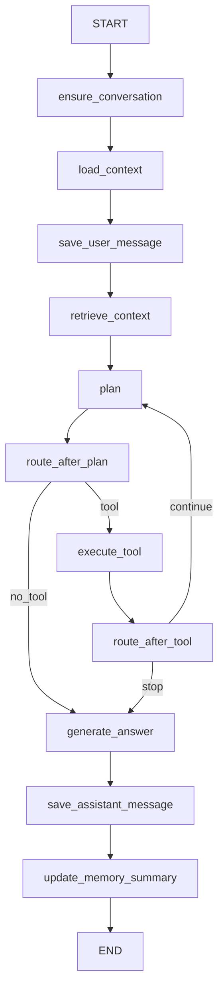
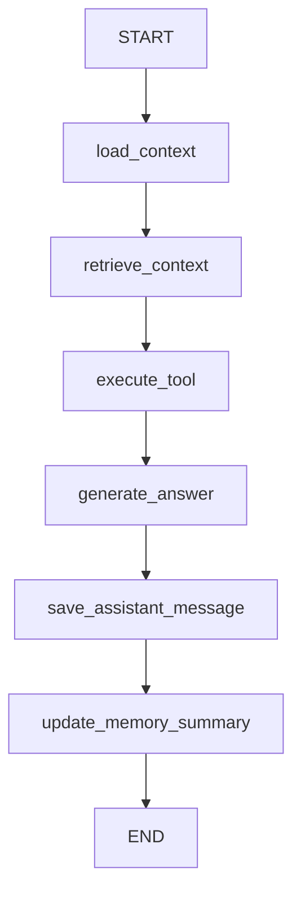

# LangGraph Refactor Handoff

This document is the implementation handoff for refactoring AgentDemo's current
hand-written agent runtime into a LangGraph-based runtime. It is intended for the
agent or engineer who will perform the refactor.

## Baseline

- Repository: `D:\workplace\AgentDemo`
- Stable branch: `run`
- Development branch: `test`
- Latest verified stable commit: `1008c1c` (`Merge branch 'test' into run`)
- Latest verified development commit: `ad9b4e8`
- Current package version: `backend/pyproject.toml` has `version = "0.1.0"`

Use `test` as the development base for implementation. After verification,
merge the tested result into `run` and push both branches.

## Current Runtime Summary

The current agent runtime is centered in `backend/app/agent/runtime.py`.

It already provides these production behaviors:

- Authenticated conversation ownership through FastAPI routes.
- SSE streaming contract consumed by the frontend.
- Conversation creation, auto-title, user message persistence, assistant message
  persistence, and metadata persistence.
- Recent message history as short-term memory.
- `MemorySummary` rows as durable long-term conversation memory.
- RAG retrieval through `RagService`.
- MCP resource and prompt injection.
- Deterministic tool planning for:
  - `read_file`
  - `web_search`
  - explicitly referenced MCP tools
- Audited tool execution through `ToolExecutor`.
- MCP policy enforcement through `McpIdentity` and `enforce_mcp_tool_policy`.
- Tool confirmation flow through `/api/conversations/chat/confirm/stream`.
- Tool call audit rows in `tool_calls`.
- Task-bound MCP events in task metadata.

The important design point: LangGraph should replace orchestration, not the
business services. Keep `ModelGateway`, `RagService`, `PluginRegistry`,
`ToolExecutor`, MCP security, and persistence models as the source of truth.

## Refactor Goal

Replace the procedural runtime loop with a LangGraph `StateGraph` while keeping
the public behavior stable:

- Keep the existing FastAPI endpoints.
- Keep the existing frontend SSE event names and payload shapes.
- Keep tool execution inside `ToolExecutor`.
- Keep current database tables as business persistence.
- Keep current tests meaningful with minimal fixture churn.
- Add graph structure that makes future multi-step, resumable, and
  human-in-the-loop workflows easier.

Do not start by using `langgraph.prebuilt.create_react_agent` as the main
runtime. The project has custom tool auditing, confirmation, MCP policy, and SSE
requirements. A custom `StateGraph` is safer and easier to migrate incrementally.

## Non-Goals For The First Pass

- Do not rewrite the frontend.
- Do not replace `ModelGateway` with LangChain chat model classes.
- Do not bypass `ToolExecutor` with LangGraph's prebuilt `ToolNode`.
- Do not redesign database schemas unless strictly required.
- Do not remove existing `/chat/confirm/stream` behavior in the first pass.
- Do not introduce LangSmith or LangGraph Cloud as a hard dependency.

## Target File Layout

Add a small graph package under `backend/app/agent`:

```text
backend/app/agent/
  runtime.py          # public compatibility wrapper; keeps SSE API
  graph.py            # builds and compiles StateGraph
  state.py            # AgentGraphState TypedDict/dataclass and reducers
  nodes.py            # graph node implementations
  events.py           # graph event to existing SSE event adapter
```

Optional later files:

```text
backend/app/agent/checkpoints.py    # checkpointer factory
backend/app/agent/tool_adapter.py   # optional LangChain tool adapters
```

Keep `AgentRuntime` import-compatible so routes and tests can continue to import:

```python
from app.agent.runtime import AgentRuntime
```

## Target Graph

The first-pass graph should mirror the existing runtime:



Use conditional edges for:

- `plan -> execute_tool | generate_answer`
- `execute_tool -> plan | generate_answer`

The route decision should preserve `max_tool_rounds`.

## State Design

Prefer `TypedDict` for graph state to avoid Pydantic overhead inside every node.
Keep Pydantic schemas at the API boundary.

Suggested state:

```python
from typing import Any, TypedDict
from uuid import UUID

from app.schemas import AgentToolPlan
from app.services.model_gateway import ModelRoute


class AgentGraphState(TypedDict, total=False):
    user_id: UUID | None
    conversation_id: UUID | None
    message: str
    task_type: str
    history: list[dict[str, str]]
    memory_summaries: list[str]
    citations: list[dict[str, Any]]
    mcp_resources: list[dict[str, Any]]
    mcp_prompts: list[dict[str, Any]]
    plan: AgentToolPlan
    tool_calls: list[dict[str, Any]]
    observations: list[str]
    final_answer: str
    trace_id: str
    route: ModelRoute
    tool_rounds: int
    max_tool_rounds: int
    events: list[dict[str, Any]]
```

`events` is an internal event buffer. Each node returns appended events; the
runtime wrapper drains or translates them to the existing SSE contract.

If using reducers, only use them for append-only lists such as `events`,
`tool_calls`, and `observations`. For fields such as `plan`, `final_answer`, and
`route`, use ordinary overwrite semantics.

## Runtime Wrapper Design

`AgentRuntime` should remain the public entrypoint.

Keep this interface:

```python
async def stream(self, request: ChatRequest) -> AsyncIterator[dict[str, str]]
async def stream_confirmed_tool(
    self, request: ToolConfirmationRequest
) -> AsyncIterator[dict[str, str]]
```

Internally:

1. Build initial `AgentGraphState`.
2. Invoke or stream the graph.
3. Convert graph updates/events to existing SSE dictionaries:

```python
{"event": event_type, "data": json.dumps(data, ensure_ascii=False)}
```

First pass can use `graph.astream(..., stream_mode="updates")` or direct
step-level emission from the wrapper. Do not require token-level LangGraph
message streaming yet, because `ModelGateway.stream_reply()` already streams
tokens and should stay in control of provider-specific HTTP behavior.

## Node Responsibilities

### `ensure_conversation`

Move the existing `_ensure_conversation` logic into a node or node helper.

Inputs:

- `conversation_id`
- `user_id`
- `message`

Outputs:

- `conversation_id`
- status event: `ensure_conversation`

Preserve ownership checks already done in routes; this node should keep the
current fallback behavior for creating a conversation when none is provided.

### `load_context`

Combine current recent-history and memory-summary loading.

Outputs:

- `history`
- `memory_summaries`
- status event: `load_history`

Also preserve auto-title behavior for new conversations.

### `save_user_message`

Persist the user message exactly once for normal chat requests.

Important: confirmed-tool continuation currently does not save a duplicate user
message. Preserve this distinction with a state flag such as:

```python
save_user_message: bool
```

Normal stream: `True`.

Confirmed tool stream: `False`.

### `retrieve_context`

Move current retrieval logic into one graph node:

- `RagService.search`
- `_load_mcp_resources_for_context`
- `_load_mcp_prompts_for_context`

Outputs:

- `citations`
- `mcp_resources`
- `mcp_prompts`
- status event: `retrieving_context`

Keep RAG behavior user-scoped through `RagService(session, user_id=user_id)`.

### `plan`

Preserve current deterministic planner initially:

- Do not repeat `read_file`.
- Do not repeat `web_search`.
- Detect file-read requests.
- Detect web-search trigger terms.
- Ask `ModelGateway.plan_tool_call` for MCP tool candidates.
- Return `AgentToolPlan(no_tool=True)` when no tool is needed.

Outputs:

- `plan`
- status event: `planning`
- `plan` event with the exact existing payload shape.

Later improvement: replace `ModelGateway.plan_tool_call` with an LLM structured
planner only after graph parity tests pass.

### `execute_tool`

This node must call existing `ToolExecutor.run`.

Do not use `ToolNode` in the first pass.

Inputs:

- `plan`
- `conversation_id`
- `user_id`
- `trace_id`

Behavior:

- Emit existing `tool_call` payload before execution.
- Resolve the selected `RegisteredTool` from `PluginRegistry`.
- Call:

```python
await self.tool_executor.run(
    tool,
    plan.arguments,
    confirmed=not plan.requires_confirmation,
    session=self.session,
    user_id=state["user_id"],
    conversation_id=state["conversation_id"],
    identity=McpIdentity(user_id=state["user_id"]),
)
```

Outputs:

- appended `tool_calls`
- appended `observations`
- incremented `tool_rounds`
- `tool_result` event

Preserve the current behavior where a tool requiring confirmation returns a
failed `ToolRunResponse` and is audited. Do not switch to LangGraph interrupts
in the first pass.

### `generate_answer`

Preserve current answer generation:

- Use `_tool_availability_answer` short-circuit when applicable.
- Otherwise call `ModelGateway.stream_reply`.
- Build context with:
  - memory summaries
  - available tool inventory
  - RAG citations
  - MCP resources
  - MCP prompts
  - tool observations

Output:

- `final_answer`
- status event: `generating`
- token events

Token events may be accumulated in `events`; the wrapper can yield them as they
arrive if the node is implemented as an async generator. If that complicates the
first pass, accept step-level buffering temporarily only if tests and UX remain
acceptable. Prefer keeping real token streaming.

### `save_assistant_message`

Persist the assistant message with current metadata:

```python
{
    "citations": state["citations"],
    "mcp_resources": state["mcp_resources"],
    "mcp_prompts": state["mcp_prompts"],
    "tool_calls": state["tool_calls"],
    "memory_summaries": state["memory_summaries"],
    "trace_id": state["trace_id"],
    "model_route": asdict(route),
}
```

Outputs:

- status event: `save_assistant_message`
- final `done` event

### `update_memory_summary`

Move current best-effort summary refresh into a node.

Rules:

- Preserve current threshold using `agent_memory_message_limit`.
- Swallow provider failures like today.
- Do not block the chat response if summary generation fails.

## Confirmed Tool Flow

First-pass compatibility:

- Keep `/api/conversations/chat/confirm/stream`.
- Build initial graph state with:
  - existing `conversation_id`
  - `save_user_message=False`
  - pre-populated `plan` from the confirmation request
  - `requires_confirmation=False`
- Enter the graph at a confirmed-tool path or use a separate small graph:



Do not require the frontend to understand LangGraph interrupts yet.

Second-pass upgrade:

- Add a checkpointer.
- Use `conversation_id` as LangGraph `thread_id`.
- Replace confirmation failure with a real `interrupt()` before risky tool
  execution.
- Resume with `Command(resume=...)` after user approval.

## Checkpoint Strategy

Do not introduce database checkpoint tables in the first compatibility pass
unless needed. Existing business tables already persist the user-visible state.

Recommended phases:

1. Phase 1: `StateGraph` without checkpointer.
2. Phase 2: `InMemorySaver` in tests and local development for interrupt
   experiments.
3. Phase 3: persistent checkpointer for production resume/debug workflows.

When adding checkpointing:

- Use `conversation_id` as `thread_id`.
- Include `user_id` in configurable metadata if helpful.
- Do not treat checkpoint state as the source of truth for messages or audit
  records; keep SQL tables authoritative.

## Public SSE Contract

Do not change these event names:

- `status`
- `plan`
- `tool_call`
- `tool_result`
- `token`
- `done`
- `error`

Preserve existing payload keys because `frontend/src/api.ts` and
`frontend/src/App.tsx` parse them.

Minimum event-order parity:

Normal tool call:

```text
status: ensure_conversation
status: load_history
status: save_user_message
status: retrieving_context
status: planning
plan
tool_call
tool_result
status: planning
plan
status: generating
token...
status: save_assistant_message
done
```

Plain chat:

```text
status...
plan(no_tool=True)
status: generating
token...
done
```

Confirmed tool:

```text
status: load_history
status: retrieving_context
plan
tool_call
tool_result
status: generating
token...
done
```

## Testing Plan

Run focused tests during development:

```powershell
cd D:\workplace\AgentDemo\backend
.\.venv\Scripts\python.exe -m pytest tests/test_agent_runtime.py
.\.venv\Scripts\python.exe -m pytest tests/test_mcp_tooling.py tests/test_web_search_plugin.py
.\.venv\Scripts\python.exe -m pytest tests/test_conversation_routes.py
```

Before merging:

```powershell
cd D:\workplace\AgentDemo\backend
.\.venv\Scripts\python.exe -m pytest
```

Frontend build:

```powershell
cd D:\workplace\AgentDemo\frontend
npm run build
```

Repository hygiene:

```powershell
cd D:\workplace\AgentDemo
git diff --check
```

## Tests To Add Or Preserve

Preserve these existing behaviors from `backend/tests/test_agent_runtime.py`:

- Plain chat uses fake gateway and no tool.
- Read file request plans and executes `read_file`.
- Tool failure is included in final answer context.
- MCP tool is planned and called through the registry.
- MCP resources and prompts enter answer context.
- SSE event order has plan before tool call, tool call before result, result
  before token.
- Assistant metadata persists trace, tool calls, and model route.
- Confirmed tool stream executes a previously blocked tool.
- Memory summaries enter answer context.
- Long conversations update memory summary.
- Max tool rounds stops looping planner.
- Chinese title normalization still works.

Add new graph-specific tests:

- `test_graph_plain_chat_matches_runtime_contract`
- `test_graph_tool_loop_stops_at_max_rounds`
- `test_graph_confirmed_tool_path_does_not_save_duplicate_user_message`
- `test_graph_preserves_done_payload_shape`
- `test_graph_records_tool_audit_through_tool_executor`

If checkpointing is added:

- `test_graph_uses_conversation_id_as_thread_id`
- `test_graph_interrupt_resume_executes_confirmed_tool_once`
- `test_graph_resume_preserves_trace_id`

## Acceptance Criteria

The refactor is complete when:

- `AgentRuntime` is backed by a LangGraph `StateGraph`.
- Existing API routes require no public contract change.
- Existing frontend SSE parser continues to work.
- Existing runtime tests pass.
- Tool calls still flow through `ToolExecutor`.
- MCP tool calls still enforce policy and write provider metadata.
- Web search still uses the configured provider and remains auditable.
- Message metadata keeps citations, MCP resources/prompts, tool calls, memory
  summaries, trace ID, and model route.
- Confirmation flow still works from the current frontend.
- No runtime data, logs, virtual environments, dependency folders, binaries, or
  secrets are committed.

## Implementation Sequence

1. Start from `test`.
2. Add `state.py` with `AgentGraphState`.
3. Add `events.py` with helpers to create existing SSE event payloads.
4. Add `nodes.py` by moving current helper logic from `AgentRuntime` into
   injected node methods or node classes.
5. Add `graph.py` to build and compile the graph.
6. Refactor `runtime.py` to:
   - keep constructor dependencies,
   - create graph dependencies,
   - drive the graph,
   - yield existing SSE events.
7. Run `tests/test_agent_runtime.py`.
8. Fix parity issues before expanding scope.
9. Run MCP and web search tests.
10. Add confirmed-tool graph path.
11. Run full backend tests.
12. Run frontend build.
13. Update README only after behavior is stable.
14. Merge `test` into `run`.
15. Push `test` and `run`.

## Risk Register

### Duplicate message persistence

The current normal stream saves a user message, but confirmed-tool stream does
not. Make this explicit in graph state.

### Tool confirmation semantics

Current behavior audits a blocked tool attempt as a failed `ToolRunResponse`.
LangGraph interrupts are better long term, but changing this immediately can
break frontend expectations. Keep compatibility first.

### Token streaming regression

If graph nodes buffer all tokens until `generate_answer` completes, UX worsens.
Prefer a wrapper that yields token events as `ModelGateway.stream_reply()` emits
them.

### Checkpointer confusion

LangGraph checkpoints should not replace SQL message and audit persistence.
They are execution snapshots, not the business record.

### Prebuilt ToolNode bypass

Using `ToolNode` directly can skip `ToolExecutor` validation, confirmation,
timeouts, output limiting, audit rows, and MCP policy. Do not use it until a
safe adapter is implemented.

### Test fixture churn

Existing tests subclass `AgentRuntime` and override private methods. During
refactor, either keep these helper methods on `AgentRuntime` as compatibility
delegates or update tests in small, focused patches.

## Future Enhancements After Parity

- Replace deterministic MCP planning with structured LLM planning.
- Add persistent LangGraph checkpointer.
- Convert confirmation flow to `interrupt()` and `Command(resume=...)`.
- Add graph state inspection endpoint for debugging.
- Add task-backed long-running graph runs.
- Add optional LangSmith tracing behind configuration.
- Build safe LangChain tool adapters that delegate to `ToolExecutor`.
